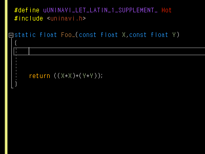



# UniNavi

Unicode Navigator for Some C IDEs

## What is this?

A set of navigators for tiny subsets of Unicode by exploiting C language structure and modern IDE features. Actually, these navigators are just fake objects which do not exist.

## Why does this exist?

Because I'm too lazy to take a hand off the keyboard and on the mouse to copy a special character from somewhere out of the editor.

## How is this supposed to use?

#define a shortcut identifier you want to use for a Unicode subset sheet. Navigate through the fake object and take your auto-completed character. After use, make sure the fake object is not left at all or it will make your build fail as intended. See also the above [demo.gif](./demo.gif) [#](http://github.com/dlOuOlb/UniNavi/blob/master/demo.gif) and [uninavi.h](./uninavi.h) [#](http://github.com/dlOuOlb/UniNavi/blob/master/uninavi.h).

## Is this portable?

No, although the C standard (§ D.1) allows some universal characters for identifiers, some IDEs would fail to construct valid ASTs. Because Unicode is hard.

## How much is this done?

Very little, and currently I have no clear plan to extend unless requested. See the below list.

- \[U+00A0-00FF\] Latin-1 Supplement [#](http://github.com/dlOuOlb/UniNavi/blob/master/Sheets/U%2B00A0-00FF%20Latin-1%20Supplement.h)
- \[U+0370-03FF\] Greek and Coptic [#](http://github.com/dlOuOlb/UniNavi/blob/master/Sheets/U%2B0370-03FF%20Greek%20and%20Coptic.h)
- \[U+2070-209F\] Superscripts and Subscripts [#](http://github.com/dlOuOlb/UniNavi/blob/master/Sheets/U%2B2070-209F%20Superscripts%20and%20Subscripts.h)
- \[U+20A0-20CF\] Currency Symbols [#](http://github.com/dlOuOlb/UniNavi/blob/master/Sheets/U%2B20A0-20CF%20Currency%20Symbols.h)
- \[U+2150-218F\] Number Forms [#](http://github.com/dlOuOlb/UniNavi/blob/master/Sheets/U%2B2150-218F%20Number%20Forms.h)
- \[U+2460-24FF\] Enclosed Alphanumerics [#](http://github.com/dlOuOlb/UniNavi/blob/master/Sheets/U%2B2460-24FF%20Enclosed%20Alphanumerics.h)
- \[U+2500-257F\] Box Drawing [#](http://github.com/dlOuOlb/UniNavi/blob/master/Sheets/U%2B2500-257F%20Box%20Drawing.h)
- \[U+2600-26FF\] Miscellaneous Symbols [#](http://github.com/dlOuOlb/UniNavi/blob/master/Sheets/U%2B2600-26FF%20Miscellaneous%20Symbols.h)

 

## Change Log

### 2020-03-14

Created uninavi.h with 4 sheets of below list:

- U+00A0-00FF Latin-1 Supplement.h
- U+0370-03FF Greek and Coptic.h
- U+2070-209F Superscripts and Subscripts.h
- U+2500-257F Box Drawing.h

 

### 2020-03-15

Modified uninavi.h with 4 sheets of below list:

- U+20A0-20CF Currency Symbols.h
- U+2150-218F Number Forms.h
- U+2460-24FF Enclosed Alphanumerics.h
- U+2600-26FF Miscellaneous Symbols.h

 
